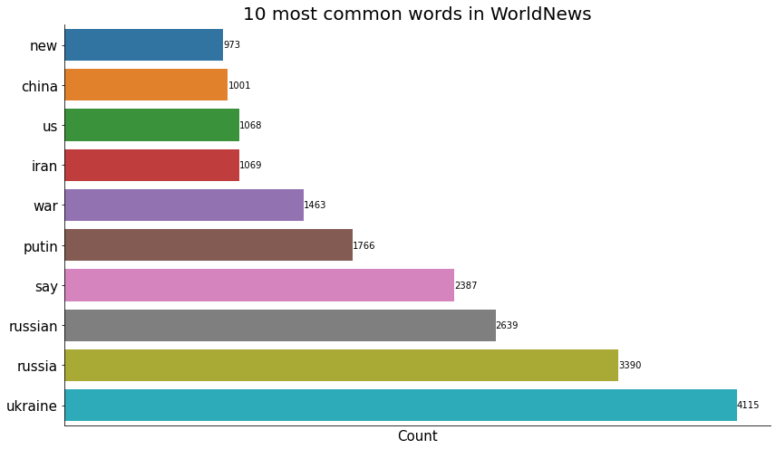
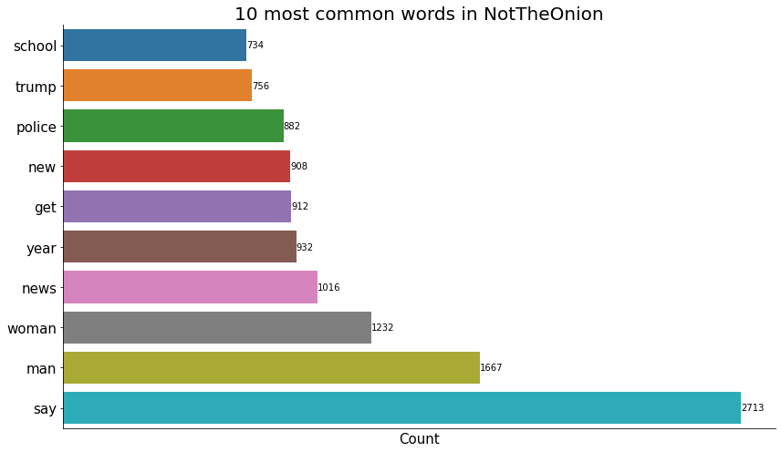
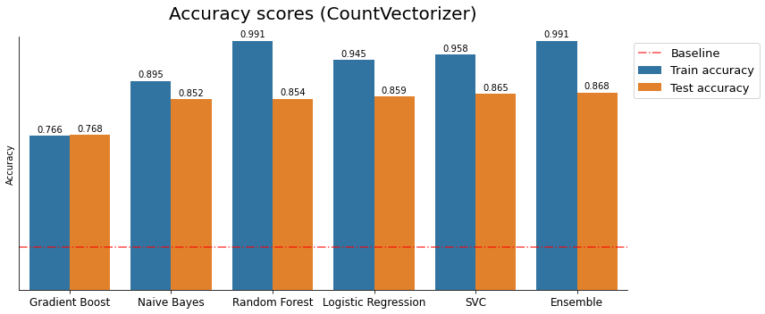
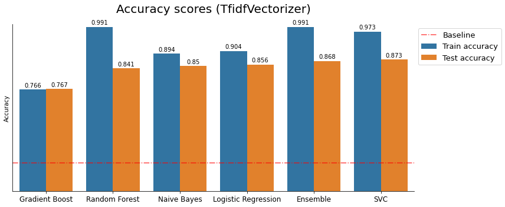
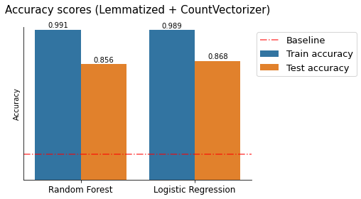

# Classifying Reddit Post Titles: WorldNews vs NotTheOnion

## Background

Two of the most popular news subreddits on Reddit are [/r/WorldNews](https://www.reddit.com/r/worldnews/) with 30.1 million subscribers and [/r/NotTheOnion](https://www.reddit.com/r/nottheonion/) with 21.9 million subscribers. Very often, posts from these subreddits reach the front page of reddit and reach thousands of people.

The description for /r/WorldNews reads:

>A place for major news from around the world, excluding US-internal news.

while the description for /r/NotTheOnion reads:

>For true stories that are so mind-blowingly ridiculous that you could have sworn they were from The Onion.

where The Onion is a publication that satirizes news.

On both of these subreddits, Redditors post news article links along with their titles. Even though both are news subreddits, as their descriptions say, they contain very different news stories.

It is a challenging job for moderators to manually remove posts that do not fit their subreddit, especially for subreddits as large as /r/worldnews and /r/nottheonion that receive hundreds of posts every day. This study aims to find the "best" classification model that predicts if a news article is appropriate for /r/worldnews or /r/nottheonion with very minimal input - only their post titles.


---

## Problem Statement

- What are the most common words in news article titles? Are they different across the two subreddits?
- How can /r/WorldNews and /r/NotTheOnion moderators use machine learning to differentiate news articles appropriate for their subreddit? 

---

## Dataset

The dataset used in this study was collected using [Pushshift's](https://github.com/pushshift/api) API. 

Pushshift API allows users to access almost everything in a reddit post but for this study, as only post titles were analyzed, only `time`, `title` and `subreddit` of each post were downloaded.

24,956 /r/WorldNews posts from Aug 31, 2022 to Oct 23, 2022 and 24,978 /r/NotTheOnion posts from May 5, 2022 to Oct 23, 2022 were downloaded.

One important note is that Pushshift API does not keep track of a post's score or its ultimate fate (e.g. the post was removed because it was inappropriate, the post reached front page, the post was shortly removed by a moderator etc.), so there are many posts that were deleted a few hours later or posts that simply never reached a wider audience are still included when a request for a subreddit's data is made.

---

## Data Cleaning

- Since some titles contain minimal text, not a lot of cleaning was done. That said, the following operations were done to clean the data:

  - English stop words in the NLTK corpus were removed.
  - Regex tokenizer that matches alphanumeric values, dollar amounts or non-white space characters from the `NLTK.tokenize` module was used to tokenize the words.
  - POS tagging was performed using the `NLTK.pos_tag` method to identify parts of speech of each word
  - `WordLemmatizer` from the `NLTK.stem` was used to group word inflections as a single word

- `CountVectorizer` module from the scikit-learn library was used to convert post titles into numeric features.

The following plot shows the 10 most common words in /r/WorldNews:



and the following plot shows the 10 most common words in /r/NotTheOnion:



As the above plots show, the posts have very different words in their titles in the two subreddits. Titles in /r/WorldNews mention countries a lot whereas titles in /r/NotTheOnion mention words related to demographics - a more "domestic" words.


- In addition, for the baseline models, `TfidfVectorizer` module from scikit-learn library was used to convert post titles to numeric features as well.

---

## Modeling

A [custom module](./code/get_pipeline.py) that builds a scikit-learn Pipeline object and implements scikit-learn's `GridSearch`. The workflow is as follows:

- Use `CountVectorizer` (or `TfidfVectorizer`) to convert a pandas Series of strings into a pandas DataFrame of numeric features.

- Define a final estimator 

- Grid search over parameters

- Compute accuracy score.

A pipeline was used to make it easier (more tractable) to cross-validate while performing grid search over a parameter grid over both the data transformation step and the model fitting step.

However, initially, six models were evaluated with the default scikit-learn parameters:

- [Logistic Regression](./code/logreg.ipynb)

- [Multinomial Naive Bayes](./code/nb.ipynb)

- [Random Forest Classifier](./code/rf.ipynb)

- [Support Vector Classifier](./code/svc.ipynb)

- [Gradient Boosting Classifier](./code/gb.ipynb)

- [Ensemble of Logistic Regression, Multinomial Naive Bayes, Random Forest, Decision Tree and Support Vector classifiers](./code/ensemble.ipynb)

After evaluating the [accuracy scores](./data/scores.json) of these models, the following models were tuned.

- [Logistic Regression](./code/logreg.ipynb)

- [Random Forest Classifier](./code/rf.ipynb)

---


## Main findings

### Some observations: Baseline models

The plot below shows the accuracy scores when `CountVectorizer` was used as a text extraction tool. The classification models are sorted in the order of their accuracy scores on the testing data.



- The baseline accuracy was 0.50.
- The accuracy scores of the baseline models were virtually identical. Th training accuracy range from 0.9 - 0.99 and the testing accuracy range from 0.85 - 0.87.
- However, they are much higher than the baseline accuracy.
- There is virtually no difference between the accuracy scores whether `CountVectorizer` or `TfidfVectorizer` is used.
- To no one's surprise, the ensemble model performed the best.
- It doesn't show here but Logistic Regression was the fastest model to fit and SVC was the slowest but they both outperform other models.

The following plot shows the accuracy scores when `TfidfVectorizer` was used as a text extraction tool. The classification models are sorted in the order of their accuracy scores on the testing data.



In this case, SVC marginally outperform even the ensemble model.

### Some observations: Parameter tuning

Given the above benchmarks, Random Forest (because it was the most overfit model) and Logistic Regression (because it was very fast) models were selected for Grid Search. Morever, only `CountVectorizer` was used as a transformer because there was virtually no difference between that and `TfidfVectorizer` in terms of affecting the test accuracy scores of the selected models.

The randomized search on hyper parameters of the logistic regression model was performed where 50 parameter settings were sampled from the following parameter grid:

```
'ngram_range': [(1,1), (1,2)],
'min_df': [1, 2, 3], 
'max_df': [0.9, 0.95],
'penalty': ['l1', 'l2'],
'solver': ['liblinear'],
'C': np.logspace(-4, 1, 50)
```
and for Random Forest, a random search of 50 iterations was performed on the following parameter grid:


```
'cvec__ngram_range': [(1,1), (1,2)],
'cvec__min_df': [0, 0.01, 0.05, 0.1], 
'cvec__max_df': [0.9, 0.95],
'rfc__max_depth': [None, *range(1, 5)],
'rfc__n_estimators': [100, 300, 500]
```
Then the accuracy scores of the best models are as follows. Again, the bars are sorted in the order of their accuracy scores on the testing data.



As one can see, logistic regression performed better than random forest. However, parameter tuning did not help the overfittedness problem. Moreover, the accuracy scores are very marginally higher than the accuracy scores of the models that were trained using the default scikit-learn settings and on data without data cleaning.

---

## Conclusion and Future Work

Given the sample data, among the models tested, the "best" model was logistic regression with the following parameters:

- solver: liblinear,
- penalty: l2,
- C: 1.5264179671752334,
- ngram_range: (1, 2),
- cvec__min_df: 1,
- cvec__max_df: 0.95

Given that both logistic regression and random forest were overfit in the benchmark models and the hyper parameter tuning did not improve on that means that more-aggressive regularization parameters should have been chosen. 

One avenue of research is to dramatically increase `min_df` parameter of `CountVectorizer` to cut down the number of features to learn from. Then the training accuracy will be lower but the model may perform better on unseen data; thus improving overfittedness.

Another avenue is to work on the tokenizer method to filter out certain words before they enter the dataset as a feature.

---

## Appendix

### Files in this directory:

    project-2
    |__ code
    |   |__ [helpers functions](./code/helpers.py)
    |   |__ [BuildPipeline module](./code/get_pipeline.py)
    |   |__ [Code used to read download data](./code/read_data.ipynb)
    |   |__ [Logistic Regression](./code/logreg.ipynb)
    |   |__ [Ensemble](./code/ensemble.ipynb)
    |   |__ [Gradient Boosting](./code/gb.ipynb)
    |   |__ [Naive Bayes](./code/nb.ipynb)
    |   |__ [Random Forest](./code/rf.ipynb)
    |   |__ [Support Vector Machine](./code/svc.ipynb)
    |   |__ [Code used to make plots](./code/plots.ipynb)
    |__ data
    |   |__ [train.csv](./data/train.csv)
    |   |__ [test.csv](./data/test.csv)
    |   |__ [train_lemmatized](./data/train_lemmatized.csv)
    |   |__ [test_lemmatized](./data/test_lemmatized.csv)
    |__ |__ [presentation.pdf](./data/slides.pdf)
    |__ images
    |   |__ [10 most common words in nottheonion](./images/10_common_words_nto.png)
    |   |__ [10 most common words in worldnews](./images/10_common_words_wn.png)
    |   |__ [cvec scores](./images/cvec_scores.png)
    |   |__ [tvec scores](./images/tvec_scores.png)
    |   |__ [lemmatized scores](./images/cvec_scores_lm.png)
    |__ README.md